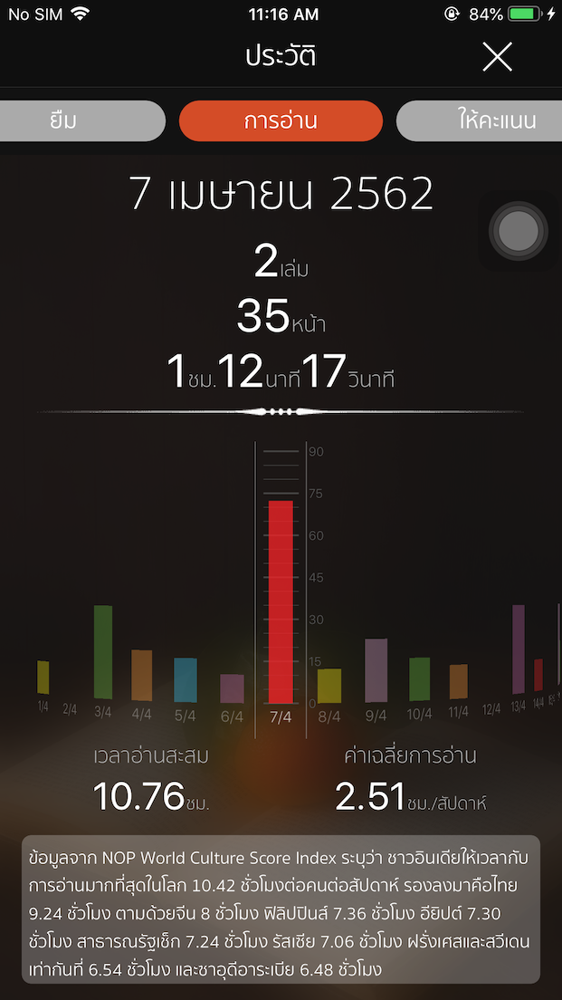

# ARChart
Customize native UIPickerView to plot bar chart.

This small project showing how to customize the native UIPickerView to plot the bar chart.
This customize UIPickerView can be used in many apps like fitness, reading or meditation apps
to show the daily activities of the users as bar chart.

